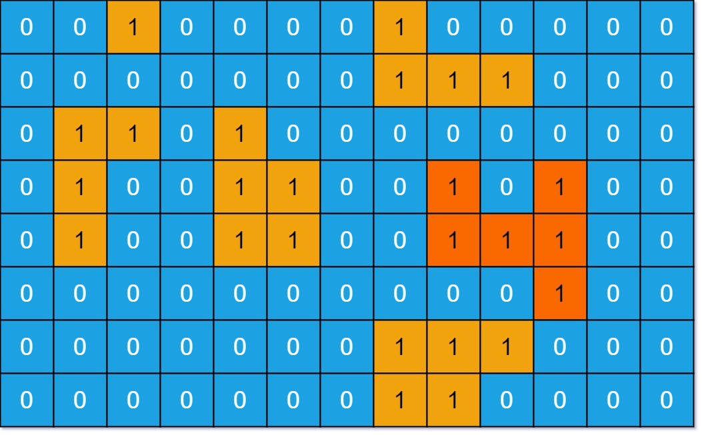

# Max Area of Island

You are given an `m x n` binary matrix `grid`. An island is a group of `1`'s (representing land) connected **4-directionally** (horizontal or vertical.) You may assume all four edges of the grid are surrounded by water.

The **area** of an island is the number of cells with a value `1` in the island.

Return _the maximum **area** of an island in_ `grid`. If there is no island, return `0`.

&#x20;

**Example 1:**

<pre><code><strong>Input: grid = [[0,0,1,0,0,0,0,1,0,0,0,0,0],[0,0,0,0,0,0,0,1,1,1,0,0,0],[0,1,1,0,1,0,0,0,0,0,0,0,0],[0,1,0,0,1,1,0,0,1,0,1,0,0],[0,1,0,0,1,1,0,0,1,1,1,0,0],[0,0,0,0,0,0,0,0,0,0,1,0,0],[0,0,0,0,0,0,0,1,1,1,0,0,0],[0,0,0,0,0,0,0,1,1,0,0,0,0]]
</strong><strong>Output: 6
</strong><strong>Explanation: The answer is not 11, because the island must be connected 4-directionally.
</strong></code></pre>

**Example 2:**

<pre><code><strong>Input: grid = [[0,0,0,0,0,0,0,0]]
</strong><strong>Output: 0
</strong></code></pre>

&#x20;

**Constraints:**

* `m == grid.length`
* `n == grid[i].length`
* `1 <= m, n <= 50`
* `grid[i][j]` is either `0` or `1`.

**Solution**


````python
```python3
class Solution:
    def maxAreaOfIsland(self, grid: List[List[int]]) -> int:
        # check if the grid is empty
        if not grid: return 0

        # initiate variables
        rows, cols = len(grid), len(grid[0])
        visited = set()
        max_area_island = 0

        # use depth first search
        def dfs(r, c):
            # initiate stack and vars
            stack = []
            stack.append((r, c))
            visited.add((r, c))
            area = 0

            # loop and pop the stack
            while stack:
                row, col = stack.pop()
                # check the direcktions
                directions = [[0, 1], [0, -1], [1, 0], [-1, 0]]
                for dr, dc in directions:
                    r = row + dr
                    c = col + dc

                    # check if grid range is valid
                    if r in range(rows) and c in range(cols):
                        cell = grid[r][c]
                        cell_pos = (r, c)
                        # check if the cell is 'island' and not visited
                        if cell == 1 and cell_pos not in visited:
                            visited.add(cell_pos)
                            stack.append(cell_pos)
                            area += 1
            return area

        for r in range(rows):
            for c in range(cols):
                # select a cell
                cell = grid[r][c]
                cell_pos = (r, c)
                # check if the cell is 'island' and not visited
                if cell == 1 and cell_pos not in visited:
                    area = dfs(r, c) + 1 # 1 for the current cell area
                    max_area_island = max(max_area_island,  area)
        
        return max_area_island

```
````


